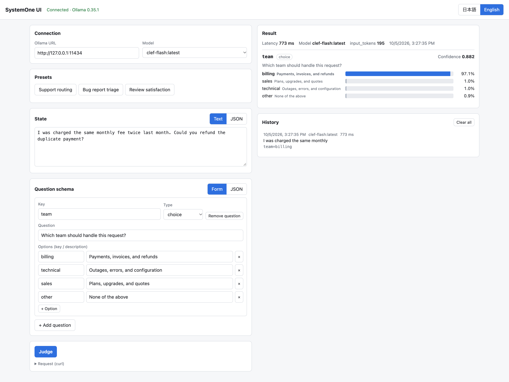

# SystemOne UI

[English](README.md) | 日本語

Ollama の SystemOne 系判断モデル (clef-flash 9B、clef 27B など) を試すための、ローカルで動く簡易 UI です。
チャットモデルではありません。`/v1/systemone` に状態と型付きの質問を渡すと、選択肢ごとの確率が返ります。

`index.html` 1 ファイルで動きます (ビルド不要・依存なし)。UI は日本語と英語に対応しています。



## 必要なもの

- Ollama 0.35.1 以上
- 判断モデル: `ollama pull clef-flash` (または `clef`)

## 起動手順

```sh
ollama serve   # 起動済みなら不要
```

このフォルダを配信し、http://localhost:8000 を開きます。

```sh
# Python
python3 -m http.server 8000 --bind 127.0.0.1

# uv (Python のインストール不要)
uv run --no-project python -m http.server 8000 --bind 127.0.0.1

# Docker
docker compose up -d --build     # 停止: docker compose down
```

`file://` ではなく `http://` で開いてください (Ollama は `Origin: null` を拒否します)。Docker でも Ollama に接続するのはブラウザなので、接続先は `http://127.0.0.1:11434` のままで構いません。

リモートの Ollama: そのホストで `OLLAMA_HOST=0.0.0.0` と `OLLAMA_ORIGINS=http://localhost:8000` を設定し、UI でその URL を入力します。

## 質問の型

- `choice`: キー付きの選択肢から 1 つ選ぶ。選択肢ごとの確率と `confidence` を返す。
- `score`: 順序付きの基準 (上から 0, 1, 2…)。期待値 (`score`)、確率、`confidence` を返す。
- `noul`: 真偽。真である確率 (`noul`) のみを返し、信頼度は返さない。

## 補足

- 取得済みのモデルのうち、`decision` capability を持つものだけが一覧に出ます。
- 状態: 「テキスト」は文字列として、「JSON」はパースしたオブジェクト/配列として送ります。
- 成功した直近 20 件を `localStorage` に保存します。クリックすると再送信せずに復元します。
- 応答時間はブラウザで計測した値で、モデルの読み込み時間を含みます。初回は数秒かかることがあります。
- 未対応: 画像入力 (`images`)、`keep_alive` などの追加パラメーター。

## API

```jsonc
// POST /v1/systemone
{
  "model": "clef-flash",
  "state": "テキスト、または JSON オブジェクト/配列",
  "questions": {
    "team":     { "type": "choice", "instructions": "...", "criteria": { "billing": "...", "technical": "..." } },
    "urgent":   { "type": "noul",   "instructions": "...", "criteria": { "true": "...", "false": "..." } },
    "severity": { "type": "score",  "instructions": "...", "criteria": ["低", "中", "高"] }
  }
}
```

ドキュメント: [ollama.com/library/clef-flash](https://ollama.com/library/clef-flash)

## ライセンス

[MIT](LICENSE)
